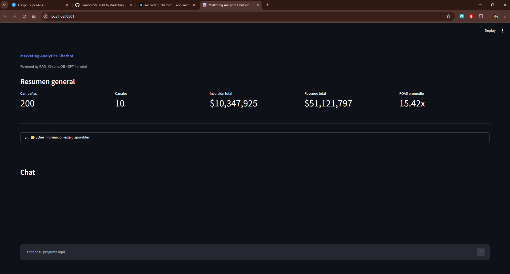
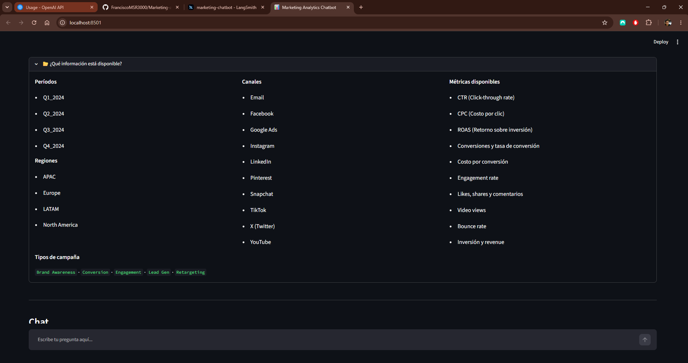
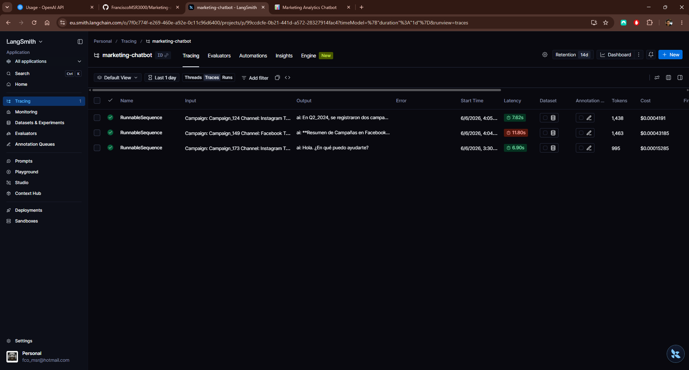

# 📊 Marketing Analytics Chatbot

A RAG-based conversational AI system that allows users to query marketing campaign data using natural language. Built to demonstrate the practical application of Generative AI in a real-world marketing analytics context.

---

## 🎯 Use Case

Instead of manually filtering spreadsheets, users can ask questions like:
- *"Which campaign had the best ROAS in Q4?"*
- *"What was the channel with the lowest cost per conversion?"*
- *"Summarize the performance of Instagram campaigns in LATAM"*

The system retrieves the most relevant data and generates a precise, data-grounded answer.

---

## 🏗️ Architecture
User Question
↓
Embedding Model (all-MiniLM-L6-v2)
↓
ChromaDB Vector Search → Top 5 relevant campaigns
↓
LangChain Prompt Builder
↓
GPT-4o-mini → Generates answer based only on retrieved data
↓
Streamlit Interface

---

## 🛠️ Tech Stack

| Layer | Technology |
|---|---|
| LLM | GPT-4o-mini (OpenAI) |
| Orchestration | LangChain |
| Vector Database | ChromaDB |
| Embeddings | sentence-transformers (all-MiniLM-L6-v2) |
| Interface | Streamlit |
| Monitoring | LangSmith |
| Data Processing | Pandas |

---

## 📁 Project Structure

    marketing-chatbot/
    ├── data/
    │   ├── generate.py        # Generates synthetic campaign data
    │   └── campaigns.csv      # 200 campaigns with 22 metrics
    ├── src/
    │   ├── ingest.py          # Loads CSV and indexes into ChromaDB
    │   └── chain.py           # RAG chain — retrieval + LLM generation
    ├── app.py                 # Streamlit interface
    ├── .env                   # API keys (not included in repo)
    └── README.md
---

## 📊 Dataset

200 synthetic marketing campaigns with 22 metrics across:

- **10 channels** — Instagram, Google Ads, TikTok, LinkedIn, YouTube, Pinterest, Email, X, Facebook, Snapchat
- **4 quarters** — Q1 to Q4 2024
- **4 regions** — LATAM, North America, Europe, APAC
- **5 campaign types** — Brand Awareness, Retargeting, Lead Gen, Conversion, Engagement

**Metrics included:** CTR, CPC, ROAS, Conversions, Conversion Rate, Cost per Conversion, Engagement Rate, Likes, Shares, Comments, Video Views, Bounce Rate, Spend, Revenue

---

## 🚀 Getting Started

### 1. Clone the repository
```bash
git clone https://github.com/FranciscoMSR3000/Marketing-analytics-chatbot.git
cd Marketing-analytics-chatbot
```

### 2. Install dependencies
```bash
pip install openai langchain langchain-openai langchain-community langchain-core
pip install chromadb pandas streamlit sentence-transformers python-dotenv
```

### 3. Configure environment variables
Create a `.env` file in the root folder:

    OPENAI_API_KEY=sk-...
    LANGSMITH_TRACING=true
    LANGSMITH_ENDPOINT=https://api.smith.langchain.com
    LANGSMITH_API_KEY=ls__...
    LANGSMITH_PROJECT=marketing-chatbot
### 4. Generate synthetic data
```bash
python data/generate.py
```

### 5. Index data into ChromaDB
```bash
python src/ingest.py
```

### 6. Run the app
```bash
streamlit run app.py
```

Open your browser at `http://localhost:8501`

---

## 🔍 Monitoring with LangSmith

Every query is automatically traced in LangSmith, capturing:
- Input prompt and retrieved context
- LLM output
- Latency per step
- Token usage and cost

---
## 📸 Screenshots

### Dashboard


### Data information


### Chat Example


### LangSmith Monitoring


---

## 👤 Author

Francisco Segura — [GitHub](https://github.com/FranciscoMSR3000)


> ⚠️ **Disclaimer:** All campaign data used in this project is entirely synthetic and generated for demonstration purposes only. It does not represent real clients, campaigns, or performance metrics from any organization. This project was built as a portfolio piece to showcase RAG-based AI applications in a marketing analytics context.